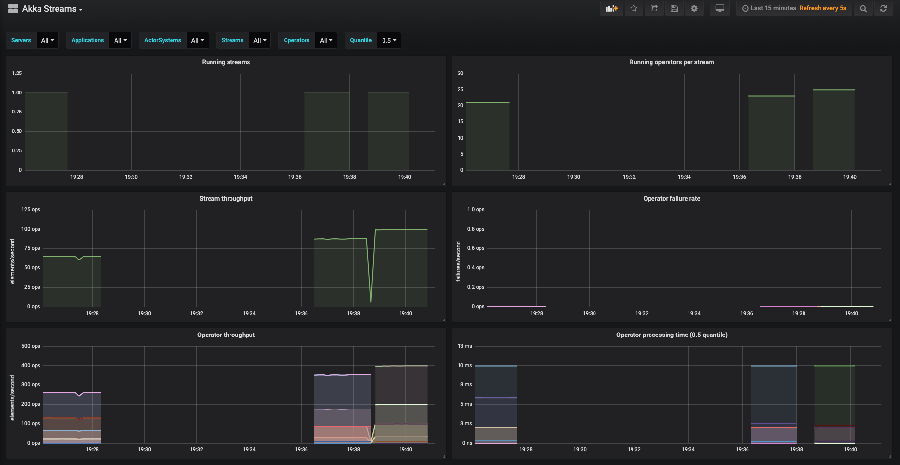
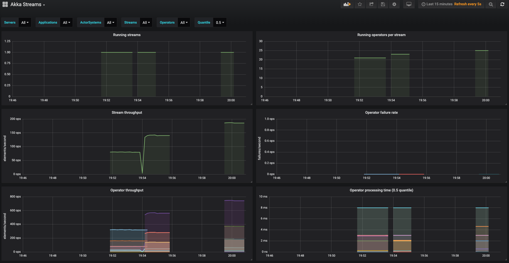
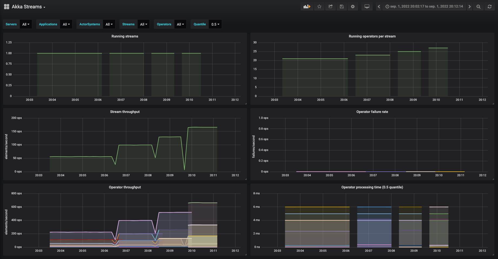

# Akka Streams Playground

This repository contains exercises resolved by me during the course, it is ignoring all copyrighted content from the course, so it is not runnable.This repository contains exercises resolved by me during the course, it ignores all copyrighted content from the course, and is not runnable.

## Fusion Run comparison

| Name                                | Time to complete the order ms |
|-------------------------------------|-------------------------------|
| 0ms                                 | 949                           |
| 16ms run                            | 15469?                        |
| 14ms (async paint)                  | 13579                         |
| 12ms (async paint & install engine) | 11485                         |
| 14ms tail run                       | 14159                         |
| 10 ms 2 asyncs run                  | 10113                         |

Try to split the stream in sections with maximum time of each one is closest to the longest stage

## Telemetry (white box) Run comparison

| Name             | Throughput |
|------------------|------------|
| 16ms             | 65         |
| 12ms (one async) | 88         |
| 10ms (two async) | 100        |

## Telemetry (black box) Run comparison

### Exercise 1

| Name               | Throughput |
|--------------------|------------|
| Baseline           | 81         |
| 1 async boundaries | 140        |
| 2 async boundaries | 186        |

### Exercise 2

| Name               | Throughput |
|--------------------|------------|
| Baseline           | 56         |
| 1 async boundaries | 100        |
| 2 async boundaries | 130        |
| 3 async boundaries | 165        |

